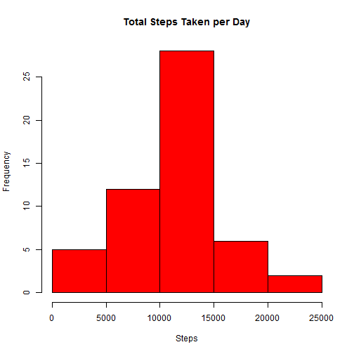
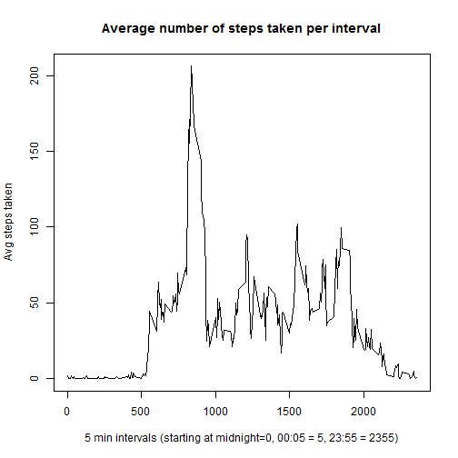
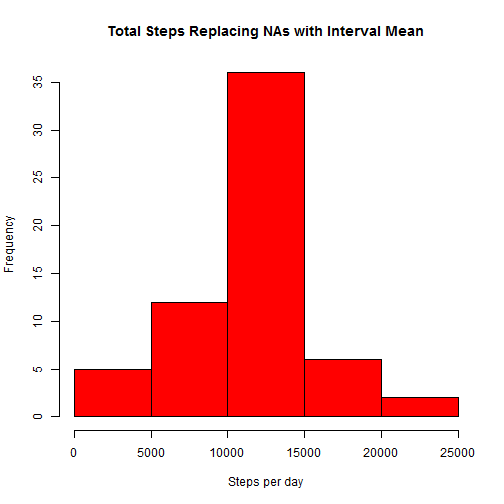
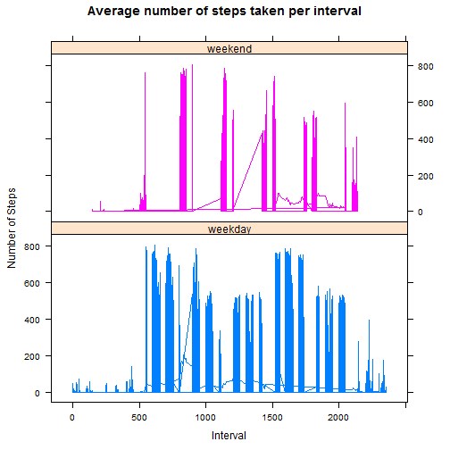

##Introduction
This assignment makes use of data from a personal activity monitoring device. This device collects data at 5 minute intervals through out the day. The data consists of two months of data from an anonymous individual collected during the months of October and November, 2012 and include the number of steps taken in 5 minute intervals each day.  Running this document will load the data into your default working directory.

##Loading and preprocessing the data
The following code is run to read in the data.  Note that the working directory is set to where the data file is stored and needs to be changed if the file is stored in a different directory (code to set directory commented out for this file).


```r
library(plyr)
#setwd("C:/Data/Coursera/5 ReproducibleResearch/Week2/")
destfile <- "exdata-data-repdata_data_activity.zip"
workfile <- "./activity.csv"
zipurl <- "http://d396qusza40orc.cloudfront.net/repdata%2Fdata%2Factivity.zip"

library(utils) ## used for the unzip function
download.file(zipurl, destfile)
unzip(destfile, overwrite = TRUE)

ds1 <- read.csv(workfile, header = TRUE) 
dsNames <- names(ds1)
```

## What is mean total number of steps taken per day?
###1.  Make a histogram of the total number of steps taken each day
Code for plot:

```r
totSteps <- aggregate( ds1$steps ~ ds1$date, data = ds1, FUN = sum, na.rm = TRUE )
names(totSteps)<-c("date","total")
hist(x=totSteps$total,freq = TRUE, col = "red", main = "Total Steps Taken per Day", xlab = "Steps", ylab = "Frequency")
```

 

###2.  Calculate and report the mean and median total number of steps taken per day
Mean Steps per Day:

```r
as.integer(mean(totSteps$total))  #summary(totSteps)[10]
```

```
## [1] 10766
```
Median Steps per Day:

```r
as.integer(median(totSteps$total))  #summary(totSteps)[11]
```

```
## [1] 10765
```

## What is the average daily activity pattern?
###1.  Make a time series plot (i.e. type = "l") of the 5-minute interval (x-axis) and the average number of steps taken, averaged across all days (y-axis)
Code for plot:

```r
StepsByInterval <- aggregate( ds1$steps ~ ds1$interval, data = ds1, FUN = mean, na.rm = TRUE )
names(StepsByInterval)<-c("interval","MeanNumOfSteps")

plot(x=StepsByInterval$interval,y=StepsByInterval$MeanNumOfSteps, type = "l",ylab = "Avg steps taken",xlab = "5 min intervals (starting at midnight=0, 00:05 = 5, 23:55 = 2355)",main = "Average number of steps taken per interval")
```

 

###2.  Which 5-minute interval, on average across all the days in the dataset, contains the maximum number of steps?
Calculated interval with maximum number of steps:

```r
print(subset(StepsByInterval,StepsByInterval$MeanNumOfSteps>=max(StepsByInterval$MeanNumOfSteps),select = c(interval)),rowheader = FALSE)
```

```
##     interval
## 104      835
```


## Imputing missing values
###1.  Calculate and report the total number of missing values in the dataset (i.e. the total number of rows with NAs)
Number of rows with NA for Number of steps:

```r
NROW(subset(ds1$steps, is.na(ds1$steps)))
```

```
## [1] 2304
```

###2.  Devise a strategy for filling in all of the missing values in the dataset. The strategy does not need to be sophisticated. For example, you could use the mean/median for that day, or the mean for that 5-minute interval, etc.
 Each interval has at least one value; for steps with a value of NA, the average steps for the corresponding interval across all days is used.
 
###3.  Create a new dataset that is equal to the original dataset but with the missing data filled in.
code for dataset:

```r
StepsByInterval$interval<- as.integer(StepsByInterval$interval)
ds2<-arrange(join(ds1,StepsByInterval),interval) # still has missing values in steps column

ds3<-subset(ds2,is.na(ds2$steps), select = c(MeanNumOfSteps,date,interval)) #select mean if steps = NA
names(ds3)<-c("steps","date","interval")
ds3<-rbind(ds3,subset(ds2,!is.na(ds2$steps), select = c(steps,date,interval))) #add records where steps exists
rm("ds2")
```
The below code is used to confirm there are no missing values:

```r
NROW(subset(ds3$steps, is.na(ds3$steps)))
```

```
## [1] 0
```

###4.  Make a histogram of the total number of steps taken each day and Calculate and report the mean and median total number of steps taken per day. Do these values differ from the estimates from the first part of the assignment? What is the impact of imputing missing data on the estimates of the total daily number of steps?

Code for the histogram:

```r
totSteps2 <- aggregate( ds3$steps ~ ds3$date, data = ds3, FUN = sum, na.rm = TRUE )
names(totSteps2)<-c("date","total")
hist(x=totSteps2$total,freq = TRUE, col = "red", main = "Total Steps Replacing NAs with Interval Mean", xlab = "Steps per day", ylab = "Frequency")
```

 

There is a slight difference, as the median has shifted to equal the mean, whereas before it was one step off.

Mean steps per day of dataset substituting average interval steps for missing values:

```r
as.integer(mean(totSteps2$total))  #summary(totSteps2)[10]
```

```
## [1] 10766
```

Median steps per day of dataset substituting average interval steps for missing values:

```r
as.integer(median(totSteps2$total))  #summary(totSteps2)[11]
```

```
## [1] 10766
```

## Are there differences in activity patterns between weekdays and weekends?
###1.  Create a new factor variable in the dataset with two levels - "weekday" and "weekend" indicating whether a given date is a weekday or weekend day.
Code for adding new factor variable:

```r
# convert factor to date & get day of week
dsNames = names(ds3)
ds3 <- cbind(ds3, weekdays(as.Date(as.character(ds1$date), "%Y-%m-%d"), abbreviate = TRUE))
names(ds3)<- c(dsNames,"DayOfWeek")
ds3$WkDay <-c("weekday")    #set intitial value to weekday 
#if saterday or sunday, change to weekend
ds3<- transform(ds3,WkDay = ifelse(ds3$DayOfWeek=="Sat" | ds3$DayOfWeek=="Sun","weekend",WkDay))
ds3$WkDay<-as.factor(ds3$WkDay)
```

###2.  Make a panel plot containing a time series plot (i.e. type = "l") of the 5-minute interval (x-axis) and the average number of steps taken, averaged across all weekday days or weekend days (y-axis). 
Code for plot:

```r
library(lattice)
xyplot(steps ~ interval | WkDay, labels = levels(ds3$WkDay), groups=WkDay, layout = c(1,2), data = ds3, type = 'l', ylab="Number of Steps", xlab = "Interval", main = "Average number of steps taken per interval")
```

 


From the above plot, there appears to be significant differences in both the number of steps and the time intervals the steps are taken between weekdays and weekends.
